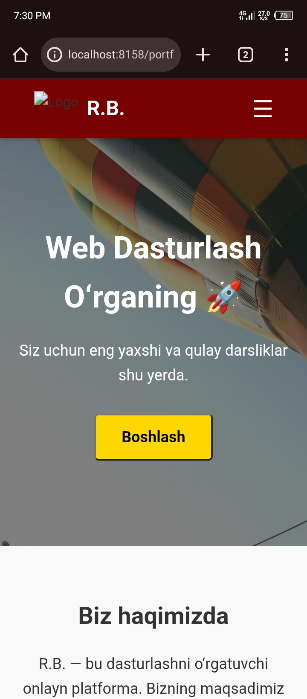
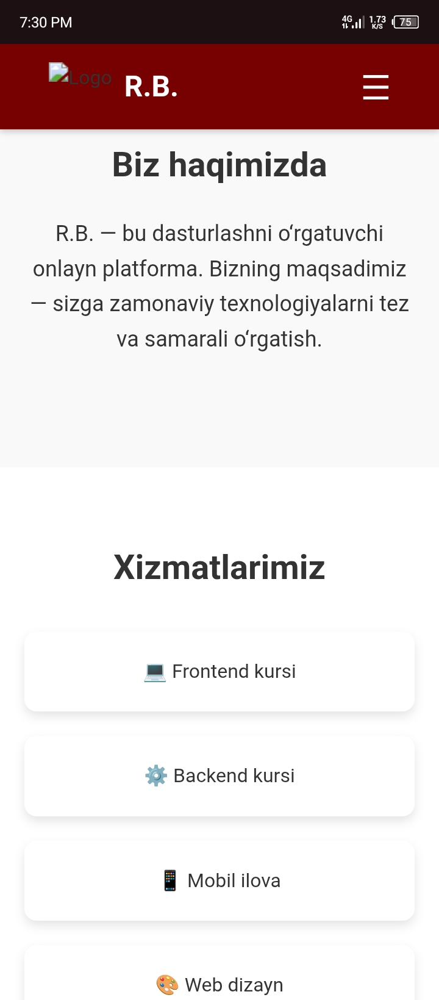

# 🌐 Portfolio Project

Bu mening birinchi **portfolio sayt loyiham**. Bu loyiha orqali HTML, CSS va JavaScript asoslarini o‘rgandim.  

---

## 📂 Fayllar tarkibi
- `index.html` – Asosiy HTML fayl
- `index.css` – Sahifa dizayni
- `index.js` – JavaScript funksiyalari
- `Screenshot_20250917-193027.jpg` – Birinchi skrenshot
- `Screenshot_20250917-193031.jpg` – Ikkinchi skrenshot
- `Screenshot_20250917-193034.jpg` – Uchinchi skrenshot

---

## 📸 Skrenshotlar

### 1️⃣ Asosiy sahifa

### 2️⃣ Menyu ko‘rinishi

### 3️⃣ Tugmalar va interaktivlik

---

## ⚙️ Texnologiyalar
- HTML5
- CSS3
- JavaScript

---

## 🚀 Ishga tushirish
1. Fayllarni yuklab ol  
2. `index.html` faylini brauzerda och  
3. Saytni ko‘rish mumkin ✅  

---

✍️ **Muallif**: Botirjon Rejabov

